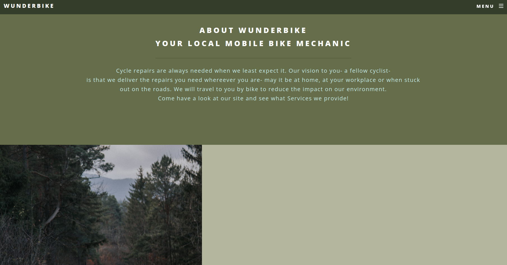

# WunderBike

### About WunderBike
A multi page website, suitable for businesses which are small to medium sized, with room to grow.
You can have a look at it here [WunderBike](https://wunderbike.netlify.app/)

### How It Is Done
Tech used: HTML5, CSS3 and JavaScript

This multi page website has been built with the potential to grow on the mind. Here we have a mobile mechanic. This mobile mechanic can be contacted through Twitter and Email. The idea here is that the mechanic travels to the client to conduct the repairs.

That means through HTML5 there are bullet points with the main selling points as well a big section where the 3 main services are offered.

CSS3 allowed me to provide a tasteful design to the site.

The structure of this project would allow to easily add more pages and online shop/booking to be implemented at a later stage if required.[^1]

[^1]: Disclaimer: This is an example of the type of work I can do.

### Lessons Learned
Working on this project has been a lot of fun, however there were a few things I have learned:

- This project could have done with a contact form, especially with the nature of customers potentially needing help real quick, a contact form would be another form for quick contact
- Online Booking is one other option for the future, where clients could book a slot for repairs
- Online payment implementation would be recommended for this type of services

The above points are in consideration for the future and will be added further down the line.
